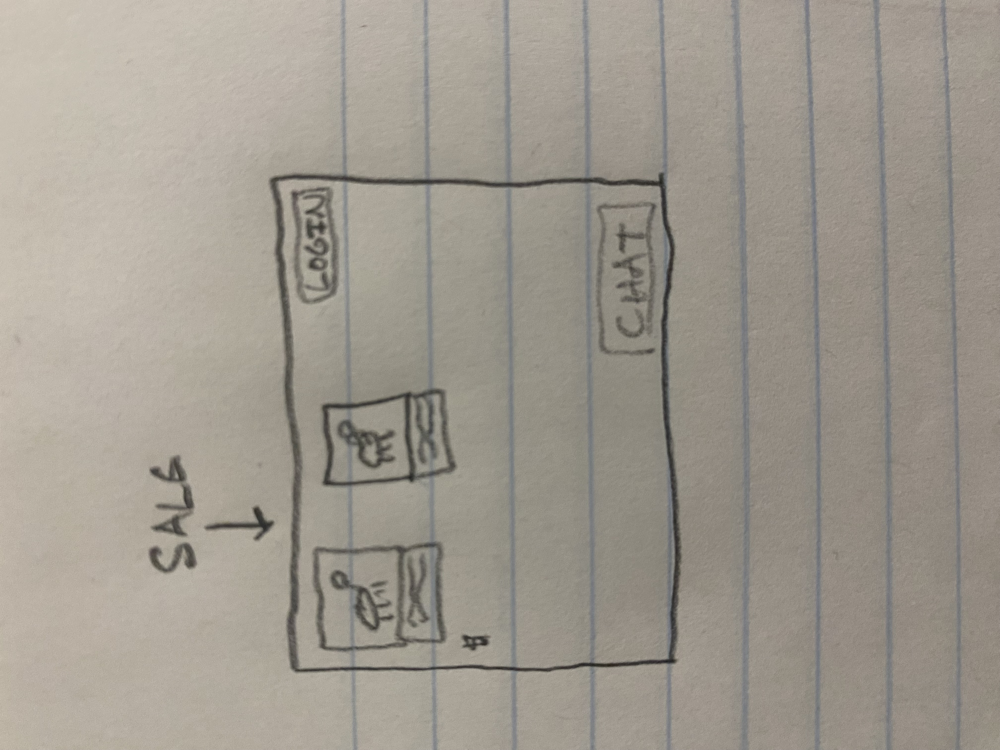
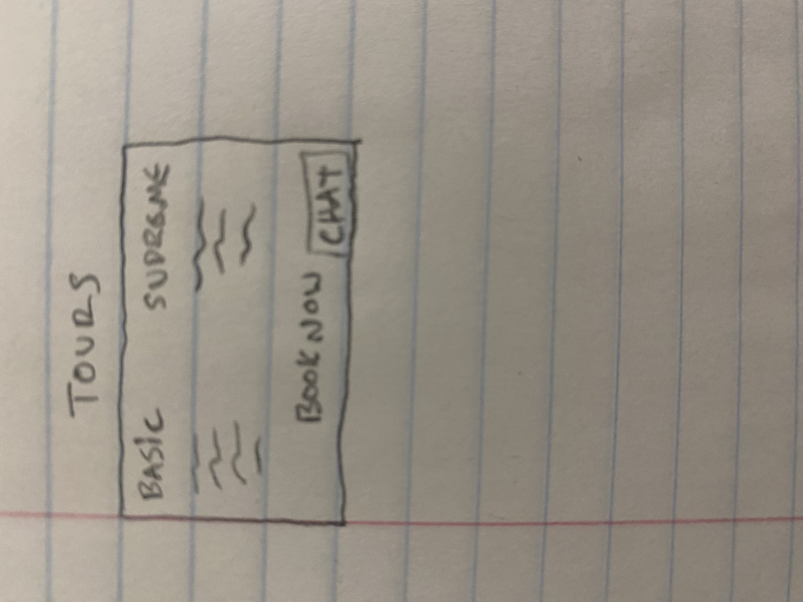

### Elevator pitch

Welcome to Taggart Urban Livestock! We breed and raise sheep for 4H and FFA kids. In addition we also run farm tours for people who want to see the animals and get a taste of the farm life. In order to coordinate all of these things and understand the services we offer check out this web page. It has all the animals we currently have on the farm. It lists everything that is for sale and the different parts of the farm you can explore when you come take a tour!

### Design

Here is a rough sketch of the for sale page. The animals on the farm page would be similar.

Here is a rough sketch of the farm tours page.

### Key features

- Display of lambs that are for sale with their prices
- Current livestock on the farm with their pedigrees
- List of options offered during the farm tours
- Life chat
- Ability for admin to and and take away different animals and farm tour features

### Technologies

I am going to use the required technologies in the following ways.

- **HTML** - Uses correct HTML structure for application. Four pages HTML pages. A home page with an about us section. One for current animals on the farm and a description of them. The second with lambs that are for sale. The final page with farm tour details.
- **CSS** - Application styling that looks good on different screen sizes, uses good whitespace, color choice and contrast and includes our logo.
- **JavaScript** - Provides login, show/hide additional information when a user clicks on an animal, shows different purchasing option when a lamb for sale is clicked on.
- **Service** - Backend service with endpoints for:
  - login
  - animal purchasing
  - tour purchasing and booking
- **DB/Login** - Store users (Users are people interested in buying lambs or farm tours). Register and login users. Credentials securely stored in database. Can't purchase unless authenticated.
- **WebSocket** - Make a live chat feature so people can talk with me and ask questions
- **React** - Application ported to use the React web framework.

