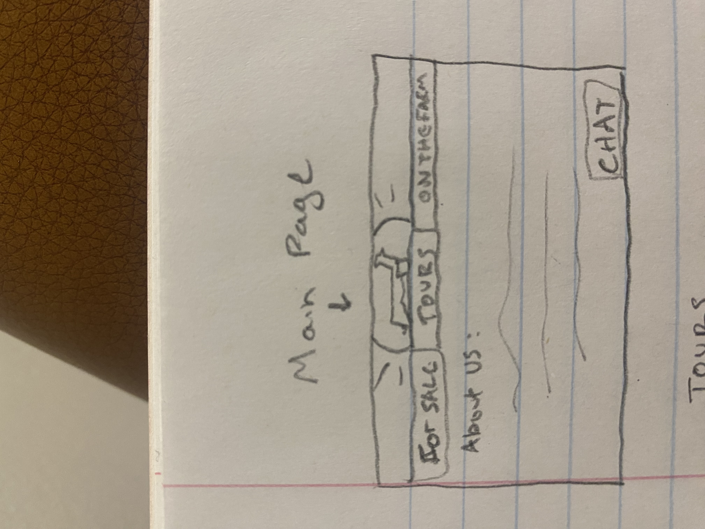

# Voter

This application serves as an example for the information you must provide in your Start Up `README.md` file for each phase of your development. You only need to fill in the section for the deliverable when you submit that deliverable in Canvas. This allows the TA to know what should be graded.

The specification deliverable section defines what your application will do. The rest of the deliverable sections reference the rubric for the deliverable and tell where the functionality is in your application, or documents that you did not satisfy that part of the rubric.

## Specification Deliverable

➡️ The following is an example of the required information for the `Startup Specification` deliverable

### Elevator pitch

Welcome to Taggart Urban Livestock! We breed and raise sheep for 4H and FFA kids. In addition we also run farm tours for people who want to see the animals and get a taste of the farm life. In order to coordinate all of these things and understand the services we offer check out this web page. It has all the animals we currently have on the farm. It lists everything that is for sale and the different parts of the farm you can explore when you come take a tour!

### Design

Here is a rough sketch of the for sale page. The animals on the farm page would be similar.

Here is a rough sketch of the farm tours page.

### Key features

- Display of lambs that are for sale with their prices
- Current livestock on the farm with their pedigrees
- List of options offered during the farm tours
- Life chat
- Ability for admin to and and take away different animals and farm tour features

### Technologies

I am going to use the required technologies in the following ways.

- **HTML** - Uses correct HTML structure for application. Four pages HTML pages. A home page with an about us section. One for current animals on the farm and a description of them. The second with lambs that are for sale. The final page with farm tour details.
- **CSS** - Application styling that looks good on different screen sizes, uses good whitespace, color choice and contrast and includes our logo.
- **JavaScript** - Provides login, show/hide additional information when a user clicks on an animal, shows different purchasing option when a lamb for sale is clicked on.
- **Service** - Backend service with endpoints for:
  - login
  - animal purchasing
  - tour purchasing and booking
- **DB/Login** - Store users (Users are people interested in buying lambs or farm tours). Register and login users. Credentials securely stored in database. Can't purchase unless authenticated.
- **WebSocket** - Make a live chat feature so people can talk with me and ask questions
- **React** - Application ported to use the React web framework.

## HTML deliverable

➡️ The following is an example of the required information for the `Startup HTML` deliverable

For this deliverable I built out the structure of my application using HTML.

- **HTML pages** - Two HTML page that represent the ability to login and vote.
- **Links** - The login page automatically links to the voter page. The voter page contains links for every voting choice.
- **Text** - Each of the voting choices is represented by a textual description.
- **Images** - I couldn't figure out how to include an image and so I didn't do this. 😔
- **DB/Login** - Input box and submit button for login. The voting choices represent data pulled from the database.
- **WebSocket** - The count of voting results represent the tally of realtime votes.

## CSS deliverable

➡️ The following is an example of the required information for the `Startup CSS` deliverable

For this deliverable I properly styled the application into its final appearance.

- **Header, footer, and main content body**
- **Navigation elements** - I dropped the underlines and changed the color for anchor elements.
- **Responsive to window resizing** - My app looks great on all window sizes and devices
- **Application elements** - Used good contrast and whitespace
- **Application text content** - Consistent fonts
- **Application images** - Still don't have images and so no styling here. 😔

## JavaScript deliverable

➡️ The following is an example of the required information for the `Startup JavaScript` deliverable

For this deliverable I implemented by JavaScript so that the application works for a single user. I also added placeholders for future technology.

- **login** - When you press enter or the login button it takes you to the voting page.
- **database** - Displayed the voting counts. Currently this is stored and retrieved from local storage, but it will be replaced with the database data later.
- **WebSocket** - I used the setInterval function to periodically increase a random vote count. This will be replaced with WebSocket messages later.
- **application logic** - The highlight and ranking number change based up the user's selections.

## Service deliverable

➡️ The following is an example of the required information for the `Startup Service` deliverable

For this deliverable I added backend endpoints that receives votes and returns the voting totals.

- **Node.js/Express HTTP service** - done!
- **Static middleware for frontend** - done!
- **Calls to third party endpoints** - I didn't have time to implement this. 😔
- **Backend service endpoints** - Placeholders for login that stores the current user on the server. Endpoints for voting.
- **Frontend calls service endpoints** - I did this using the fetch function.

## DB/Login deliverable

➡️ The following is an example of the required information for the `Startup DB/Login` deliverable

For this deliverable I associate the votes with the logged in user. I stored the votes in the database.

- **MongoDB Atlas database created** - done!
- **Stores data in MongoDB** - done!
- **User registration** - Creates a new account in the database.
- **existing user** - Stores the votes under the same user if the user already exists.
- **Use MongoDB to store credentials** - Stores both user and their votes.
- **Restricts functionality** - You cannot vote until you have logged in. This is restricted on the frontend only. 😔

## WebSocket deliverable

➡️ The following is an example of the required information for the `Startup WebSocket` deliverable

For this deliverable I used webSocket to update the votes on the frontend in realtime.

- **Backend listens for WebSocket connection** - done!
- **Frontend makes WebSocket connection** - done!
- **Data sent over WebSocket connection** - done!
- **WebSocket data displayed** - All user votes display in realtime. I'm really proud that this is working. Way cool!

## React deliverable

➡️ The following is an example of the required information for the `Startup React` deliverable

For this deliverable I converted the application over to use Vue. I know it is supposed to use React, but the instructor said I could use Vue because I already have extensive experience with React.

- **Bundled and transpiled** - done!
- **Components** - Login, voting list, vote are all components.
- **Router** - Routing between login and voting components.
- **Hooks** - Vue uses class properties instead of `UseState` to track changes in vote state.
